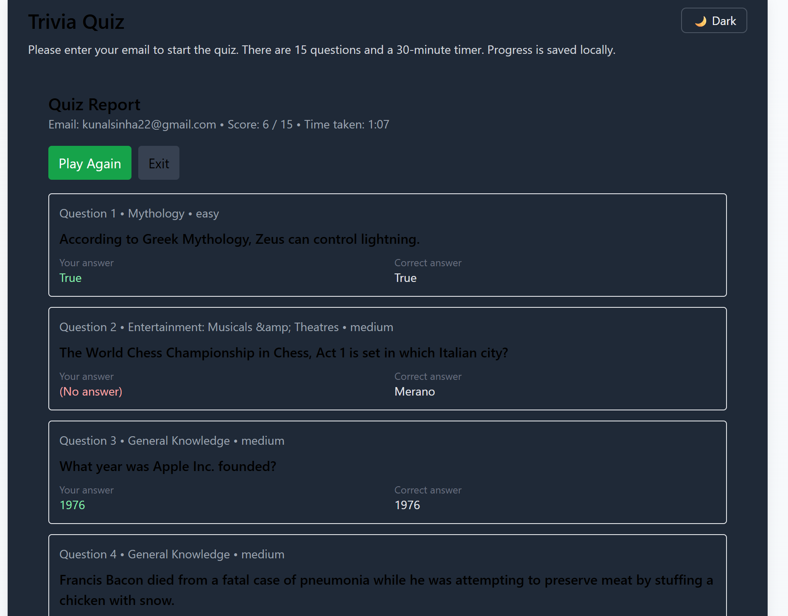

# 🎯 Trivia Quiz — SDE Intern 2025 Assignment

![quiz-preview]


2)images/Screenshot 2025-08-12 194620.png
3)images/Screenshot 2025-08-12 194718.png
4)images/Screenshot 2025-08-12 194726.png
5)images/Screenshot 2025-08-12 194806.png
6)images/Screenshot 2025-08-12 194813.png
7)images/Screenshot 2025-08-12 194834.png
8)images/Screenshot 2025-08-12 194854.png


## 🌐 Live Demo
https://sdeintern-rfmkxsdjw-kunal-sinhas-projects.vercel.app

---

## 📂 Repository
https://github.com/kunalsinha26/SDE-Intern/tree/main

---

## 📜 Overview & Approach
This is a **15-question trivia quiz** application built as part of the SDE Intern 2025 assignment.  
The application is designed to be **responsive, fast, and resilient**, with **state persistence** and **server-side email validation** to mimic production-grade features.

**Approach:**
1. **Tech stack selection**: Used **Next.js** for a full-stack-in-one-repo approach, **TailwindCSS** for quick styling, and **Framer Motion** for smooth UI animations.
2. **Data fetching**: Trivia questions are fetched from Open Trivia DB through a custom Next.js API route (`/api/trivia`) to handle CORS and allow future expansion.
3. **State persistence**: Used `localStorage` to save quiz progress (questions, answers, timer) so the user can resume after refresh.
4. **Email validation**: Implemented client + server-side validation via `/api/validate-email`.
5. **UI/UX focus**: Added a dark/light toggle, animated transitions, and a progress overview panel to improve user experience.

---

## 🧩 Components Built
- **`Quiz`** — Core logic: timer, question navigation, state management.
- **`QuestionCard`** — Displays a single question with options.
- **`OverviewPanel`** — Shows all question numbers with answered/visited indicators.
- **`Report`** — Shows final score and correct/incorrect answers after submission.
- **`ThemeToggle`** — Dark/light mode switcher.
- **API routes**:
  - `/api/trivia` — Fetches and returns trivia questions.
  - `/api/validate-email` — Validates the user’s email before starting.

---

## ⚡ Setup & Installation
```bash
# Clone repository
git clone https://github.com/yourusername/trivia-quiz-sde2025
cd trivia-quiz-sde2025

# Install dependencies
npm install

# Run in development mode
npm run dev
# Visit: http://localhost:3000

# Build for production
npm run build
npm run start

---

📌 **Assumptions**
- The Open Trivia DB API is always reachable (basic error handling included).  
- User emails require only format validation, no OTP verification.  
- Local storage is sufficient for persistence — no backend DB needed.

---

🚧 **Challenges & Solutions**

| Challenge                | Problem & Solution                                                                                  |
|--------------------------|---------------------------------------------------------------------------------------------------|
| **Timer resets on reload**   | Timer restarted from 30 mins on refresh. Stored `startedAt` timestamp in `localStorage` to fix.   |
| **CORS errors with API**      | Client fetch caused CORS issues. Implemented Next.js API proxy at `/api/trivia`.                   |
| **Responsive layout breaks**  | Table-based UI failed on smaller screens. Rebuilt using Flexbox + Tailwind responsive utilities.  |
| **Duplicate questions from API** | API sometimes returned duplicates. Added shuffle logic and unique keys to prevent UI glitches.      |

---

🌟 **Why This Project Stands Out**

- Full-stack in a single repository — clean, maintainable codebase with frontend & backend logic.  
- Smooth animations powered by Framer Motion for delightful UX.  
- Robust state handling allows refreshing mid-quiz without losing progress.  
- Server-side email validation — demonstrating production readiness.

---

📜 **License**

This project is licensed under the **MIT License** — see the `LICENSE` file for details.

---

📬 **Contact**

**Your Name**  
✉️ your.email@example.com  
🔗 GitHub: https://github.com/yourusername
